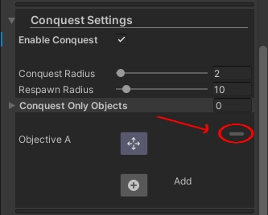

# Mod Tools

## Description
The **Mod Tools** project is designed for users who want to create mods for **Carnage Wars**. 😊

## Table of Contents
1. [Prerequisites](#prerequisites)
2. [Installation](#installation)
3. [Usage](#usage)
   - [Setting Up a Map](#setting-up-a-map)
   - [Configuring the Map for Export](#configuring-the-map-for-export)
   - [Exportable Components](#exportable-components)
4. [Notes](#notes)
5. [License](#license)
6. [Acknowledgements](#acknowledgements)

## Prerequisites
Before installing the Mod Tools in your Unity project, ensure the following packages are installed from the Package Manager to avoid compiler issues:
- `com.unity.ai.navigation`
- `com.unity.nuget.newtonsoft-json`
- `com.unity.postprocessing`

## Installation
To install the project, download the latest version from the [Releases](#) section.

## Usage

### Setting Up a Map

After installing the Unity package, follow these steps to set up and export your map:

1. **Open or Create a Scene:**
   - Open the scene with your map, or create a new scene and build the map you want to export.
   
2. **Ensure Proper Collider Setup:**
   - Make sure your map has all necessary colliders set up correctly.

3. **Add the ModMapManager Prefab:**
   - Go to the `Prefabs` folder under `source/Prefabs` and drag the `ModMapManager` prefab into your scene.
   
   

4. **Access Map Tools:**
   - Select the `ModMapManager` in the Hierarchy. You should see the Map Tools in the Inspector panel.
   
   

### Configuring the Map for Export

1. **General Setup:**
   - Expand the "General" section by clicking the arrow next to it.
   
   

   a. **Edit Playable Area:**
      - Click the "Edit Area" button to enter Area Edit Mode. Use this tool to set the area on your map that players are allowed to access. Please set this area as small as possible to avoid precision issues.
      
      

      **Note:** Placing points requires the stage colliders to be set up.

   b. **Set Spawn Points:**
      - Select the "Edit SpawnPoints" button to enter SpawnPoints Mode. Left-click anywhere in the scene to place a spawn point. Right-click a spawn point to remove it.
      
      

   c. **Set Weapon Spawn Points:**
      - Select the "Edit WeaponsSpawnPoints" button to enter WeaponsSpawnPoints Mode. Left-click anywhere in the scene to place a weapon spawn point. Right-click a spawn point to remove it. Weapon spawns are crucial for Battle Royale mode.
      
      

   d. **Base Setup:**
      - To set up a team base point, click the "Set Team Base" button and then click the area where you want the team's base to be. Players will automatically spawn close to this point in modes that require them to spawn at their base.
      - To set up a team flag point, click the "Set Team Flag" button and then click the area where you want the team's flag to be.

      **Note:** You'll need to set up the base and flag for both teams to avoid issues.
      
      

   - When you are done with the general setup, you can minimize the foldout to make the scene look cleaner as you move to the next section.

2. **Bots Setup:** 
   - Expand the Bots Settings.
   - Click the "Edit BotsReferencePoints" button to edit the reference points for bots. These points are crucial for bots' navigation. Place them around corners, near windows, and in areas that bots can access. Place them only on floors and other reachable areas.
   
   

3. **Conquest Setup:** 
   - Expand the Conquest Settings to reveal the Conquest Setup. Enable Conquest by checking the "Enable Conquest" checkbox.
   
   

   - The Conquest Radius slider controls the size of Conquest Objectives.
   - The Respawn Radius slider controls the radius within which the Conquest Objective will collect respawn points. This should be considerably larger than the Conquest Radius. Ensure respawn points are placed within the radius of each objective you add.
   - The "Conquest Only Objects" list contains stage objects that you want to load only in Conquest Mode. Add any object from the scene to the list, and they will be disabled in other modes.
   - To add a new Conquest Objective, click the "+" button.
   
   

   - After adding the Conquest Objective, click the  button and tap where you want in the stage to move the objective to that point.
   
   

   - To remove a Conquest Objective, click the "-" button on the top right of the Objective Setup.
   
   

### Exportable Components

The exporter can handle the following components, if available in your scene:

1. **Mesh Renderers:**
   - Exports mesh, sprite, and text renderers.

2. **Colliders:**
   - Includes all colliders set up in the scene.

3. **Sounds:**
   - Exports any sound sources present in the scene.

4. **Lights:**
   - Exports all types of lights.

5. **Lightmaps:**
   - Includes baked lightmaps.

6. **Light Probes:**
   - Exports light probes used in the scene.

7. **NavMesh Surface:**
   - Exports the local NavMesh surface. (Found in the `ModMapManager` prefab)

8. **Post Processing Volume:**
   - Must be set up on the Main Camera to be exported.

9. **Render Settings:**
   - Exports the render settings of the scene.

10. **Shaders:**
    - Exports all shaders used in the scene.

11. **Terrains:**
    - Exports terrain components.

12. **Materials:**
    - Includes all materials used in the scene.

13. **LOD Groups:**
    - Exports LOD (Level of Detail) groups.

14. **Reflection Probes:**
    - Exports reflection probes.

15. **NavMesh Links:**
    - Exports any NavMesh links present in the scene.

16. **Other Components:**
    - Exports additional components, such as post-processing volumes, that might be specific to your scene.

## Notes
- Ensure all required components are set up and correctly configured before exporting the map.
- The exporter currently supports only the local NavMesh surface. Other NavMesh surfaces will be supported in future updates.

## License
(Include information about the project's license here.)

## Acknowledgements
(Include credits and acknowledgements here.)
