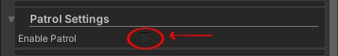
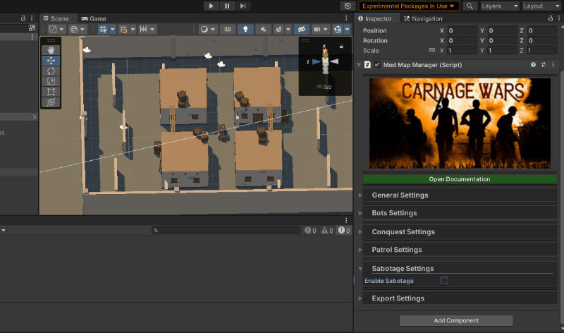

# Mod Tools

The **Mod Tools** project is designed for users who want to create mods for **Carnage Wars**. 😊

## Table of Contents
1. [Prerequisites](#prerequisites)
2. [Installation](#installation)
3. [Usage](#usage)
   - [Setting Up a Map](#setting-up-a-map)
   - [Configuring the Map for Export](#configuring-the-map-for-export)
   - [Exportable Components](#exportable-components)
4. [Notes](#notes)
5. [License](#license)
6. [Acknowledgements](#acknowledgements)

## Prerequisites
Before installing the Mod Tools in your Unity project, ensure the following packages are installed from the Package Manager to avoid compiler issues:
- `com.unity.ai.navigation`
- `com.unity.nuget.newtonsoft-json`
- `com.unity.postprocessing`

## Installation
To install the project, download the latest unitypackage from the [Releases](https://github.com/Zac2k/Mod-Tools/releases/tag/Release) section.

## Usage

### Setting Up a Map

After installing the Unity package, follow these steps to set up and export your map:

1. **Open or Create a Scene:**
   - Open the scene with your map, or create a new scene and build the map you want to export.
   
2. **Ensure Proper Collider Setup:**
   - Make sure your map has all necessary colliders set up correctly.

3. **Add the ModMapManager Prefab:**
   - Go to the `Prefabs` folder under `source/Prefabs` and drag the `ModMapManager` prefab into your scene.
   
   

4. **Access Map Tools:**
   - Select the `ModMapManager` in the Hierarchy. You should see the Map Tools in the Inspector panel.
   
   

### Configuring the Map for Export

1. **General Setup:**
   - Expand the "General" section by clicking the arrow next to it.
   
   

   a. **Edit Playable Area:**
      - Click the "Edit Area" button to enter Area Edit Mode. Use this tool to set the area on your map that players are allowed to access. Please set this area as small as possible to avoid precision issues.
      
      

      **Note:** Placing points requires the stage colliders to be set up.

   b. **Set Spawn Points:**
      - Select the "Edit SpawnPoints" button to enter SpawnPoints Mode. Left-click anywhere in the scene to place a spawn point. Right-click a spawn point to remove it.
      
      

   c. **Set Weapon Spawn Points:**
      - Select the "Edit WeaponsSpawnPoints" button to enter WeaponsSpawnPoints Mode. Left-click anywhere in the scene to place a weapon spawn point. Right-click a spawn point to remove it. Weapon spawns are crucial for Battle Royale mode.
      
      

   d. **Base Setup:**
      - To set up a team base point, click the "Set Team Base" button and then click the area where you want the team's base to be. Players will automatically spawn close to this point in modes that require them to spawn at their base.
      - To set up a team flag point, click the "Set Team Flag" button and then click the area where you want the team's flag to be.

      **Note:** You'll need to set up the base and flag for both teams to avoid issues.
      
      

   - When you are done with the general setup, you can minimize the foldout to make the scene look cleaner as you move to the next section.

2. **Bots Setup:** 
   - Expand the Bots Settings.
   - Click the "Edit BotsReferencePoints" button to edit the reference points for bots. These points are crucial for bots' navigation. Place them around corners, near windows, and in areas that bots can access. Place them only on floors and other reachable areas.
   
   

3. **Conquest Setup:** 
   - Expand the Conquest Settings to reveal the Conquest Setup. Enable Conquest by checking the "Enable Conquest" checkbox.
   
   

   - The Conquest Radius slider controls the size of Conquest Objectives.
   - The Respawn Radius slider controls the radius within which the Conquest Objective will collect respawn points. This should be considerably larger than the Conquest Radius. Ensure respawn points are placed within the radius of each objective you add.
   - The "Conquest Only Objects" list contains stage objects that you want to load only in Conquest Mode. Add any object from the scene to the list, and they will be disabled in other modes.
   - To add a new Conquest Objective, click the "+" button.
   
   

   - After adding the Conquest Objective, click the  button and tap where you want in the stage to move the objective to that point.
   
   

   - To remove a Conquest Objective, click the "-" button on the top right of the Objective Setup.
   
   

4. **Patrol Setup:** 
   - Expand the Patrol Settings to reveal the Patrol Setup. Enable Patrol by checking the "Enable Patrol" checkbox.
   
   

   - The "Patrol Only Objects" list contains stage objects that you want to load only in Patrol Mode. Add any object from the scene to the list, and they will be disabled in other modes.

   - To add a new Patrol Objective, click the  button.

   - To Edit a Patrol Objective, click the  button. To enter the Points Edit Mode, left-click anywhere on the map to place a marker for the Patrol Point. To remove a marker, right-click on it. The white line wrapping the markers represents the main area used for computation.

   

5. **Sabotage Setup:** 
   - Expand the Sabotage Settings.
   - Click the "Enable Sabotage" checkbox.
   - You can add Sabotage Points by clicking the  button.
   - After adding, you can position the points by clicking the  and clicking the area of the scene where you want to place it.
   
   

6. **Export Setup:** 
   - Expand the Export Settings.
   
   

   - **Build Target:** This is the target platform that asset bundles will be built for. Please select only Android or Windows for now.
   - **Info:** These settings control how the map is set up.
     - **Name:** The name of the map.
     - **Description:** Short description of the map.
     - **Vehicles:** Disabling this will force vehicles to be off in the map.
     - **Traps:** Ignore this for now.
     - **Supply Crate:** Controls if the supply pilot should come and drop the supply crate.
     - **Size:** Map size (0: small, 1: medium, 2: large).
     - **Icon:** This is the icon of the map. It is very important to display the loading screen.
     - **Map Icon:** Not necessary.
     - **Has Safe Zone:** This option is very useful for modes like Sabotage on large maps.
     - **Show in MP:** This will make the map show in custom MP modes.
     - **Show in BR:** This will make the map show in custom BR modes.
   - **Platforms:** Ignore this for now.
   - **Compress Mesh UVs:** This option will cause the mesh UVs to be compressed and reduce map disk size.
   - **Compress Mesh Vertices:** This will compress the mesh geometry and reduce disk space.
   - **Convert Shaders:** This is very important if you plan to atlas your map with the Pack Textures option. This will convert most of the map's shaders to a shader in ZicZac/, which will be good for performance as more unnecessary shaders won't be loaded into RAM and will also allow changing of Shader Quality.
   - **Pack Textures:** This will pack the textures of the map into atlases. This will only pack converted materials or materials using shaders under ZicZac/ or GLTF.
   - **Atlas Size:** The size of each atlas. Please don't set this higher than 2048 if you are not using a very powerful GPU and lots of RAM.
   - **Max Texture Size:** This is the max size of each texture in the atlas. Must be a power of 2 (e.g., 256, 512, 1024, 2048, 4096).
   - **Mesh Compression:** Set this to the desired level. The highest level will make the meshes much smaller but might cause minor visual artifacts.
   - **Build:** 
      - When You Are Done With All Settings And You Are Sure Your Map Is Ready, Click The Build Map Button, This Might Take A While To Build The Map, WHen The Map Is Done Building It Will Open The Folder Containing The Exported Map And You Can Place The Map On Your Device And Install It To Test.

   You Can Load An Exported Map In The Editor To See How It WIll Look In-Game.

   **Warning** : Loading A Map From The ModMapManager In The Editor Is A Destructive Process And Will Replace Some Of Your Scene Settings So Please Load Mods On Empty Scenes That Dont Contain Any Important Settings.

### Exportable Components

The exporter can handle the following components, if available in your scene:

1. **Mesh Renderers:**
   - Exports mesh, sprite, and text renderers.

2. **Colliders:**
   - Includes all colliders set up in the scene.

3. **Sounds:**
   - Exports any sound sources present in the scene.

4. **Lights:**
   - Exports all types of lights.

5. **Lightmaps:**
   - Includes baked lightmaps.

6. **Light Probes:**
   - Exports light probes used in the scene.

7. **NavMesh Surface:**
   - Exports the local NavMesh surface. (Found in the `ModMapManager` prefab)

8. **Post Processing Volume:**
   - Must be set up on the Main Camera to be exported.

9. **Render Settings:**
   - Exports the render settings of the scene.

10. **Shaders:**
    - Exports all shaders used in the scene.

11. **Terrains:**
    - Exports terrain components.

12. **Materials:**
    - Includes all materials used in the scene.

13. **LOD Groups:**
    - Exports LOD (Level of Detail) groups.

14. **Reflection Probes:**
    - Exports reflection probes.

15. **NavMesh Links:**
    - Exports any NavMesh links present in the scene.

16. **Other Components:**
    - Exports additional components, such as post-processing volumes, that might be specific to your scene.

## Notes
- Ensure all required components are set up and correctly configured before exporting the map.
- The exporter currently supports only the local NavMesh surface. Other NavMesh surfaces will be supported in future updates.

## License
MIT License

Copyright (c) 2024 ZicZac

Permission is hereby granted, free of charge, to any person obtaining a copy
of this software and associated documentation files (the "Software"), to deal
in the Software without restriction, including without limitation the rights
to use, copy, modify, merge, publish, distribute, sublicense, and/or sell
copies of the Software, and to permit persons to whom the Software is
furnished to do so, subject to the following conditions:

The above copyright notice and this permission notice shall be included in all
copies or substantial portions of the Software.

THE SOFTWARE IS PROVIDED "AS IS", WITHOUT WARRANTY OF ANY KIND, EXPRESS OR
IMPLIED, INCLUDING BUT NOT LIMITED TO THE WARRANTIES OF MERCHANTABILITY,
FITNESS FOR A PARTICULAR PURPOSE AND NONINFRINGEMENT. IN NO EVENT SHALL THE
AUTHORS OR COPYRIGHT HOLDERS BE LIABLE FOR ANY CLAIM, DAMAGES OR OTHER
LIABILITY, WHETHER IN AN ACTION OF CONTRACT, TORT OR OTHERWISE, ARISING FROM,
OUT OF OR IN CONNECTION WITH THE SOFTWARE OR THE USE OR OTHER DEALINGS IN THE
SOFTWARE.

